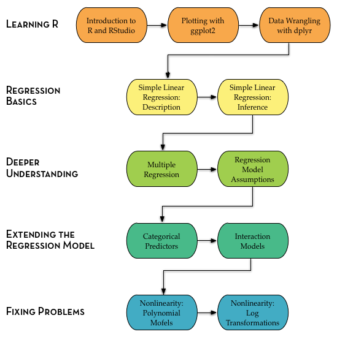

# EPsy 8251 (Fall 2017) {-}


```{r out.width="85%", echo=FALSE, fig.align='center'}

```

<br />

Welcome to Andy's EPsy 8251: Methods in Data Analysis for Educational Research I website. This site is intended to complement the [course syllabus]((https://github.com/zief0002/epsy-8251/blob/master/s17-8251-syllabus.pdf?raw=true)) by serving as an organizational hub for the course. Here you will be able to access course materials such as readings, notes, assignments, and data sets. It also includes helpful links and resources for each of the course topics.

<br />

### Office Hours {-}

Andy Zieffler ([zief0002@umn.edu](mailto:zief0002@umn.edu?Subject=EPsy%208251)) <br />
Tuesday 9:30AM&ndash;10:30AM (and by appointment) <br />
[Education Sciences Building 178](http://campusmaps.umn.edu/education-sciences-building)

<br />

### Downloading Materials {-}

You can download all of the course materials from the [Github repository](https://github.com/zief0002/epsy-8251/). Or, you can simply [click this link](https://github.com/zief0002/epsy-8251/archive/master.zip) to download a ZIP file of all the materials. Individual files can also be downloaded from the Course Resources page. 

<br />

### R and RStudio {-}

The course uses R and RStudio. First download and install R from [http://www.r-project.org/](http://www.r-project.org/). Then download and install RStudio from [http://www.rstudio.org/](http://www.rstudio.org/).


# Course Resources {-}


### Syllabus {-}

- [Spring 2017 Syllabus](https://github.com/zief0002/epsy-8251/blob/master/s17-8251-syllabus.pdf?raw=true)


<br /><br />

### Textbook {-}

Some of the required course textbooks are available via the University of Minnesota library.

- [Applied regression: An introduction](http://primo.lib.umn.edu/TWINCITIES:mncat_discovery:UMN_ALMA21533776460001701)

<br /><br />

### Data Sets {-}

- [beauty.csv](https://github.com/zief0002/epsy-8251/blob/master/data/beauty.csv?raw=true)
- [mnSchools.csv](https://github.com/zief0002/epsy-8251/blob/master/data/mnSchools.csv?raw=true)
- [movies.csv](https://github.com/zief0002/epsy-8251/blob/master/data/movies.csv?raw=true)
- [regional-colleges.csv](https://github.com/zief0002/epsy-8251/blob/master/data/regional-colleges.csv?raw=true)
- [riverside.csv](https://github.com/zief0002/epsy-8251/blob/master/data/riverside.csv?raw=true)


<br /><br />

# Assignments {-}

Checking. Interesting. ah.

Let's try a link: [Syllabus](https://github.com/zief0002/epsy-8251/blob/master/F16-8251-Syllabus-Section-01.pdf?raw=true)


# Course Topics {-}

Here is a map of the topics we will cover in EPsy 8251.

<br />

```{r out.width="70%", echo=FALSE, fig.align='center'}

```


## Introduction to R and RStudio {-}

To prepare for class:

- Install R and RStudio on your computer.
- Watch the video [R for Starters: R and R Studio Workspace](https://www.youtube.com/watch?v=uKyQyfenfvM)

<br />

Here are other R and RStudio resources you may want to explore:

- [RStudio Keyboard Shortcuts](https://support.rstudio.com/hc/en-us/articles/200711853-Keyboard-Shortcuts)
- [R for Data Science](http://r4ds.had.co.nz/)


## Plotting with ggplot2 {-}

To prepare for class, watch the videos:

- [Plotting with ggplot: Part 1](https://www.youtube.com/watch?v=HeqHMM4ziXA)
- [Plotting with ggplot: Part 2](https://www.youtube.com/watch?v=n8kYa9vu1l8)

<br />

Here are other ggplot2 resources you may want to explore:

- [ggplot2 Cheatsheet](https://www.rstudio.com/wp-content/uploads/2015/08/ggplot2-cheatsheet.pdf)
- [ggplot2 Extensions](http://www.ggplot2-exts.org/index.html)
- [Data Stories podcast: ggplot2, R, and data toolmaking with Hadley Wickham](http://datastori.es/67-ggplot2-r-and-data-toolmaking-with-hadley-wickham/)
- Wickham, H. (2010). [A layered grammar of graphics.](http://vita.had.co.nz/papers/layered-grammar.pdf) <i>Journal of Computational and Graphical Statistics, 19</i>(1), 3&ndash;28.


## Data Wrangling with dplyr {-}


To prepare for class, read:

- [dplyr Vignette](https://cran.rstudio.com/web/packages/dplyr/vignettes/introduction.html)

<br />

Here are other dplyr resources you may want to explore:

- [dplyr Cheatsheet](https://www.rstudio.com/wp-content/uploads/2015/02/data-wrangling-cheatsheet.pdf)
-[Data Wrangling with R and RStudio](https://github.com/rstudio/webinars/blob/master/05-Data-Wrangling-with-R-and-RStudio/wrangling-webinar.pdf)


## Simple Linear Regression: Description {-}

To prepare for class, read:

- Lewis-Beck &amp; Lewis-Beck (Chap. 1)

<br />

Here are other resources you may want to explore:

- [Guess the Correlation Game](http://guessthecorrelation.com/)


## Simple Linear Regression: Inference {-}

To prepare for class, read:

- Lewis-Beck &amp; Lewis-Beck (Chap. 2)

<br />

Here are other resources you may want to explore:

- [Dance of the p-values](https://www.youtube.com/watch?v=ez4DgdurRPg)


## Multiple Regression {-}

To prepare for class, read:

- Lewis-Beck &amp; Lewis-Beck (Chap. 3)

<br />

Here are other resources you may want to explore:

- [Confounding Variables](http://www.icpsr.umich.edu/icpsrweb/instructors/setups2008/exercises/notes/confounding.jsp)


## Regression Assumptions {-}

To prepare for class, re-read:

- Lewis-Beck &amp; Lewis-Beck (Chap. 2)

<br />

Here are other resources you may want to explore:

- [Visualizing Residuals](https://drsimonj.svbtle.com/visualising-residuals)

                            

## Categorical Predictors {-}

To prepare for class, read:

- [What is Dummy Coding?](http://www.ats.ucla.edu/stat/mult_pkg/faq/general/dummy.htm)
- [What is Effect Coding?](http://www.ats.ucla.edu/stat/mult_pkg/faq/general/effect.htm)

<br />

Here are other resources you may want to explore:

- [fiveThirtyEight: p-Hacking](http://fivethirtyeight.com/features/science-isnt-broken/#part3)
- Gelman, A., Hill, J., &amp; Yajima, M. (2012). [Why we (usually) don’t have to worry about multiple comparisons.](http://www.stat.columbia.edu/~gelman/research/published/multiple2f.pdf) <i>Journal of Research on Educational Effectiveness, 5,</i> 189&ndash;211.
- [Regression with dummy variables](https://www.lib.umn.edu/get?url=http://methods.sagepub.com%2Fbook%2Fregression-with-dummy-variables)


## Interaction Models {-}

To prepare for class, read:

- Brambor, T., Clark, W. R., &amp; Golder, M. (2006). [Understanding interaction models: Improving empirical analyses.](http://mattgolder.com/files/research/pa_final.pdf) *Political Analysis, 14*, 63&ndash;82. doi:10.1093/pan/mpi014


## Nonlinearity: Polynomial Models {-}

To prepare for class:

- Read [Math is Fun: Quadratic Equations](https://www.mathsisfun.com/algebra/quadratic-equation.html)
- Watch the video [Polynomial Regression (Coursera)](https://www.coursera.org/learn/ml-regression/lecture/hMhl1/polynomial-regression)


<br />

Here are other resources you may want to explore:

- [Math is Fun: Polynomials](https://www.mathsisfun.com/algebra/polynomials.html)


## Nonlinearity: Log-Transformations {-}

To prepare for class:

- Read through [Interpreting log-transformed predictors/outcomes](http://www.cazaar.com/ta/econ113/interpreting-beta)

<br />

Here are other resources you may want to explore:

- [Was the Nepal Earthquake Twice as Big as We Thought?](http://qz.com/394053/was-the-nepal-earthquake-twice-as-big-as-we-thought/)
